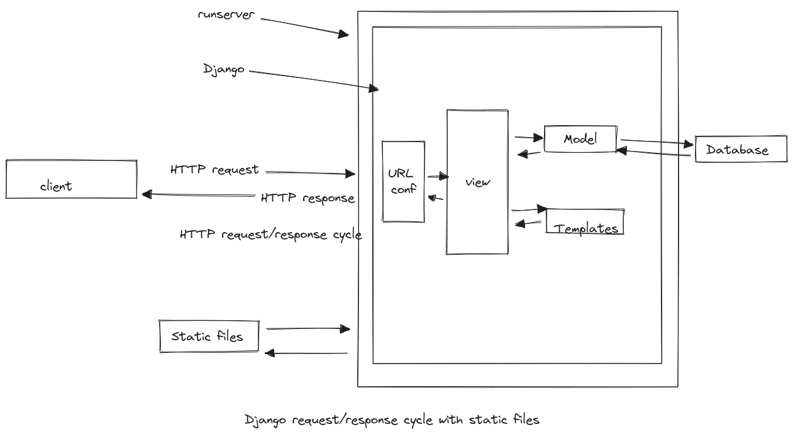

# Message Board App

- admin interface
- orm
- testing

Thanks to the powerful Django ORM (Object-Relational Mapper), there
is built-in support for multiple database backends: 
1. PostgreSQL
2. MySQL
3. MariaDB
4. Oracle
5. SQLite

As a result, developers can write the same Python code in a models.py file, which will automatically be translated into the correct SQL for each database. 
The only configuration required is to update the DATABASES section of our django_project/settings.py
file.

For local development, Django defaults to using SQLite because it is file-
based and, therefore, far more straightforward to use than the other database options that require a dedicated server to run separately from Django itself.

## Setup

```bash
$ mkdir message-board

$ cd message-board

$ python3 -m venv .venv

$ source .venv/bin/activate
$ (.venv)

(.venv) $ python -m pip install django

(.venv) § django-admin startproject django_project .
(.venv) $ python manage.py startapp posts
```

As a final step, update **django_project/settings.py** to alert Django to
the new app, posts, by adding it to the bottom of the INSTALLED_APPS
section.

Then execute the migrate command to create an initial database based on
Django’s default settings.

```shell
(.venv) $ python manage.py migrate
```

```shell
.
├── db.sqlite3
├── django_project
│   ├── asgi.py
│   ├── __init__.py
│   ├── settings.py
│   ├── urls.py
│   └── wsgi.py
├── manage.py
└── posts
    ├── admin.py
    ├── apps.py
    ├── __init__.py
    ├── migrations
    │   └── __init__.py
    ├── models.py
    ├── tests.py
    └── views.py
```
A db.sqlite3 file is created the first time you run either migrate.
migrate will sync the database with the current
state of any database models contained in the project and listed in
INSTALLED_APPS.

In other words, to ensure the database reflects the current state, you will need to run migrate (and also makemigrations) eachtime you update a model.

### Create a Database Model

Our first task is to create a database model where we can store and display
posts from our users. 

Django’s ORM will automatically turn this model into
a database table for us.
In a real-world Django project, there are often many complex, interconnected database models, but we only need one in our simple
message board app.

Open the posts/models.py file and look at the default code which Django
provides:

```python
# posts/models.py
from django.db import models
# Create your models here
```

Django imports a module, models, to help us build new database models
which will “model” the characteristics of the data in our database.

For each database model we want to extend django.db.models.Model and then add our fields.
To store the textual content of a message board post, we can do the following:

```python
# posts/models.py
from django.db import models
class Post(models.Model): # new

text = models.TextField()
```

Note that we’ve created a new model called Post, which has the
database field text.
We've also specified the type of content it will hold, TextField(). 

Django provides many model fields supporting common
types of content such as characters, dates, integers, emails, and so on.


Activating Post Model:

Now that our new model has been created, we need to activate it.
From now on, whenever we make or modify an existing model, we’ll need to update Django
in a **two-step process**:

1. First, we create a migrations file with the makemigrations command.
Migration files create a reference of any changes to the database models,
which means we can track changes-and debug errors as necessary-over
time.

*python manage.py makemigrations posts* 

2. Second, we build the database with the migrate command, which
executes the instructions in our migrations file.

*python manage.py migrate*


```bash
(.venv) $ python manage.py makemigrations posts
Migrations for 'posts':

posts/migrations/0001_initial.py


├── db.sqlite3
├── django_project
├── manage.py
└── posts
    ├── admin.py
    ├── apps.py
    ├── __init__.py
    ├── migrations
    │   ├── 0001_initial.py  # new file
    │   └── __init__.py
    ├── models.py
    ├── tests.py
    └── views.py
```

- Create model Post

```bash
(.venv) $ python manage.py migrate
Operations to perform:

Apply all migrations: admin, auth, contenttypes, posts,
sessions
Running migrations:

Applying posts.0001_initial... OK

```
You don’t have to include a name after makemigrations. 
If you just run makemigrations without specifying an app, a migrations file will be
created for all available changes throughout the Django project. 
That is fine in a small project like ours with only a single app, but most Django projects
have more than one app!
Therefore if you made model changes in multiple apps, the resulting migrations file would include all those changes: not ideal! 
Migrations files should be as small and concise as possible, making it easier 
to debug in the future or even roll back changes as needed. 

Therefore, as a best practice, adopt the habit of always including the name of an app when 
executing the makemigrations command!

### Django Admin

One of Django’s killer features is its robust admin interface that visually interacts with data. 
It came about because Django started off as a newspaper CMS (Content Management System). 
The idea was that journalists could write and edit their stories in the admin without needing to touch “code.” 
Over time, the built-in admin app has evolved into a fantastic, out-of-the-box tool for managing all aspects of a Django project.

To use the Django admin, we must first create a superuser who can login. 

In your command line console, type **python manage.py createsuperuser**
and respond to the prompts for a username, email, and password:

```Shell
(.venv) $ python manage.py createsuperuser
Username (leave blank to use 'wsv'): piet
Email: bla@bla.com
Password:
Password (again):

Superuser created successfully.
```

Are posts are not displayed in the Django Admin Interface.
Just as we must explicitly add new apps to the INSTALLED_APPS config, so,
too, must we update an app’s admin.py file for it to appear in the admin.

In your text editor, open up posts/admin.py and add the following code to
display the Post model.

```python
# posts/admin.py
from django.contrib import admin
from .models import Post
admin.site.register(Post)
```

Django now knows it should display our posts app and its database model
Post on the admin page. If you refresh your browser, you'll see that it
appears.

We can save data via our Django interface be add Text and click the save button.
owever, if you look closely, there’s a problem: our new entry is called “Post object (1)”,
which isn’t very descriptive!

Within the posts/models.py file, add a new method called str, which provides a human-readable representation of the model. 

In this case, we’ll have it display the first 50 characters of the text field.

```python
# posts/models.py
from django.db import models
class Post(models.Model):

    text = models.TextField()

    def _ str_ (self): # new
        return self.text[:50]
```

If you refresh your Admin page in the browser, you'll see it's changed to a
much more descriptive and helpful representation of our database entry.

### Views/Templates/URLs
In order to display our database content on our homepage, we have to
wire up our views, templates, and URLSs. 

Let’s begin with the view. 

Earlier, we used the built-in generic
TemplateView to display a template file on our homepage. 

Now we want to list the contents of our database model. 
Fortunately, this is also a common
task in web development, and Django comes equipped with the generic class-based ListView.

In the posts/views.py file, replace the default text and enter the Python code below:

```python 
# posts/views.py
from django.views.generic import ListView
from .models import Post

class HomePageView(ListView):

    model = Post
    template_name = "home.html"

```

On the first line, we're importing ListView and in the second line, we import the Post model. 
In the view, HomePageView, we subclass ListView and specify the correct model and template.

Our view is complete, meaning we still need to configure our URLs and
make our template. Let’s start with the template. Create a new project-level
directory called templates.

```Shell
(.venv) $ mkdir templates
```

Then update the DIRS field in our django_project/settings.py file
so that Django can look in this new templates directory.

```python
# django_project/settings.py
TEMPLATES = [
{
    ...
    "DIRS": [BASE_DIR / "templates"], # new
    ...
}
]
```

create a new file called templates/home.html.

ListView automatically returns to us a context variable called
<model>_list, where <model> is our model name, that we can loop
over via the built-in for template tag.

We'll create a variable called post and can then access the desired field we want to be displayed:

```html
<!-- templates/home.html -->
<h1>Message board homepage</h1>
<ul>



<1i>{{ post.text }}</1i>


</ul>
```

The last step is to set up our URLSs. Let’s start with the django_project/
urls.py file, where we include our posts app and add include on the
second line.

```python
# django_project/urls.py
from django.contrib import admin
from django.urls import path, include # new

urlpatterns = [
    path("admin/", admin.site.urls),
    path("", include("posts.urls")), # new
]
```

create a new urls.py file within the posts app
and update it like so:

```python
# posts/urls.py
from django.urls import path
from .views import HomePageView

urlpatterns = [
    path("", HomePageView.as_view(), name="home"),
]
```

### Git 

Everything works, so it is a good time to initialize our directory and create
a .gitignore file. 

```shell
(.venv) §$ git init
```

create a new . gitignore file in the root directory
and add three lines so that the . venv directory, Python bytecode, and the
db. sqlite file are not stored. 

The local database is just for testing purposes anyway, not for production, and in addition to becoming quite large might contain sensitive information you do not want to be stored in a remote code repository. 

Therefore it is a best practice not to track it with Git.

message-board_live/.gitignore

```shell
.venv/
db.sqlite3
*.pyc
```

Then add and commit the newly created and changed files:

```shell
(.venv) $ git add .
(.venv) $ git add commit -m "inital commit"
```

### Topics:
0. more note on what we have done last Friday
1. adding Model to Django Admin Interface 
2. ListView
3. static assets (js, css, images)
4. testing this project (which includes a database)


### Static Files

Static files are the Django community’s term for additional files
commonly served on websites such as CSS, fonts, images, and JavaScript.

Even though we haven’t added any yet to our project, we are already
relying on core Django static files-custom CSS, fonts, images, and
JavaScript-to power the look and feel of the Django admin.

We don’t have to worry about static files for local development because the
web server-run via the runserver command-will automatically find and
serve them for us. 

Here is what static files look like in visual form added to
our existing Django diagram:


1. Add to *django_project/settings.py*:

```python
STATIC_URL = 'static/'
STATICFILES_DIRS = [BASE_DIR / 'static/'] #new
```

2. create *static/css/styles.css* in root of project

## Topic 

1. Testing
2. create a new project ('blog' project)
3. recap static, ListView, css
4. DetailView
5. Primary Key and Foreign Key in django models 
6. User Table
7. Parameterized urls / routes


### Tests

Previously, we were only testing static pages, so we used SimpleTestCase. 

Now that our project works with a database, we need to use **TestCase**, which will let us create a test database.

In other words, we don’t need to run tests on our actual database but instead can make a separate test
database, fill it with sample data, and then test against it, which is a much safer and more performant approach.

Our Post model contains only one field, text, so let’s set up our data and then check that it is stored correctly in the database. 

All test methods must start with the phrase test so that Django knows to test them!

We will use the hook *setUpTestData()* to create our test data:
it is much faster than using the *setUp()* hook from Python’s unittest because it creates the test data only once per test case rather than per test. 

It is still common, however, to see Django projects that rely on setUp () instead. 

Converting any such tests over to setUpTestData is a reliable way to speed up a test suite and should be done!

setUpTestData() is a classmethod which means it is a method that can transform into a class. 

To use it, we’ll use the @classmethod function decorator. 

As PEP 8 explains, in Python it is a best practice to always use c1s as the first argument to class methods.

Here is what the code looks like:

```python
# posts/tests.py
from django.test import TestCase
from .models import Post

class PostTests(TestCase):
    @classmethod
    def setUpTestData(cls):
        cls.post = Post.objects.create(text="This is a test!")
    def test_model_content(self):
        self.assertEqual(self.post.text, "This is a test!")
```

At the top, we import TestCase and our Post model.

Then we create a test class, PostTests, that extends TestCase and uses the built-in method setUpTestData to develop initial data. 

In this instance, we only have one item stored as c1s.post that can be referred to in subsequent tests within the class as self.post. 

Our first test, test_model_content, uses assertEqual to check that the content of the text field matches what we expect.

Run the test on the command line with command python manage.py test.

```Shell
(.venv) $ python manage.py test
Found 1 test(s).
Creating test database for alias 'default'...
System check identified no issues (0 silenced).
Ran 1 test in 0.001s
0K
Destroying test database for alias 'default'...
```

It passed! Why does the output say only one test ran when we have two functions?
Again, only functions that start with the name `test` will be run!

So while we can use set-up functions and classes to help with our tests, unless a function is named correctly it won’t be executed with the python manage.py testcommand.

Moving along, it is time to check our URLSs, views, and templates like in the previous project.

We will want to check the following four things for our message
board page:

- URL exists at / and returns a 200 HTTP status code
- URL is available by its name of “home”
- Correct template is used called “home.html”
- Homepage content matches what we expect in the database

We can include all of these tests in our existing PostTests class since this project has only one webpage. 

Make sure to import reverse at the top of the page and add the four tests as follows:

```python
from django.test import TestCase
from django.urls import reverse

from .models import Post

class PostTests(TestCase):
    @classmethod
    def setUpTestData(cls):
        cls.post = Post.objects.create(text="This is a test!")

    def test_model_content(self):
        self.assertEqual(self.post.text, "This is a test!")

    def test_url_exists_at_correct_location(self):
        resp = self.client.get('/')
        self.assertEqual(resp.status_code, 200)

    def test_url_available_by_name(self):
        resp = self.client.get(reverse('home'))
        self.assertEqual(resp.status_code, 200)

    def test_template_name_correct(self):
        resp = self.client.get(reverse('home'))
        self.assertTemplateUsed(resp, 'home.html')

    def test_template_content(self):
        resp = self.client.get(reverse('home'))
        self.assertContains(resp, 'This is a test!')
```

If you rerun our tests again you should see that they all pass.

```Shell
(.venv) $ python manage.py test
Found 5 test(s).
Creating test database for alias 'default'...
System check identified no issues (0 silenced).
Ran 5 tests in 0.006s
0K
Destroying test database for alias 'default'...

```

Ultimately, we want our test suite to cover as much code functionality as possible yet remain easy for us to reason about. 

That’s enough tests for now; it’s time to commit the changes to Git.

```Shell
(.venv) $ git add .
(.venv) $ git commit -m "added tests"
```