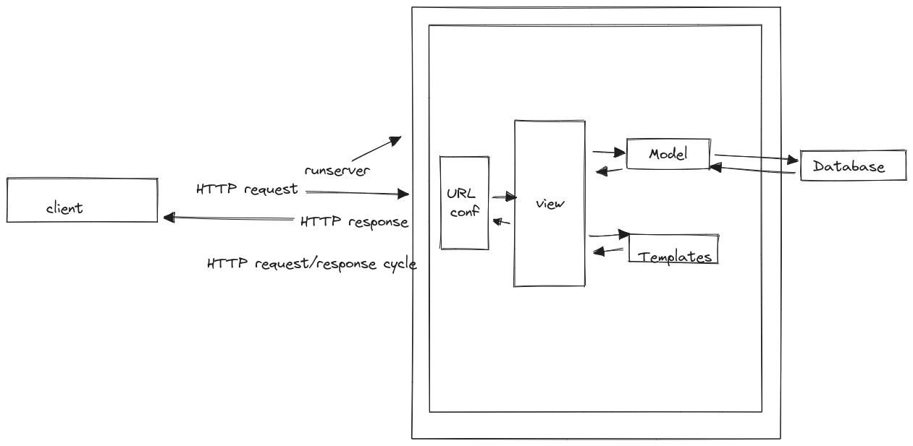

## How Websites Work - fundamentals behind the Internet and the World Wide Web

- The Internet is a broad global system of interconnected computers; 
- the World Wide Web is a subset of the Internet that refers to hypertext documents linked together via hyperlinks (in other words, webpages)

- The internet relies on various “communication protocols” 
- they are are like human languages in that they allow computers all over the world to communicate with one another via agreed-upon conventions. 

For example,
1. file sharing uses the File Transfer Protocol (FTP),
2. sending email uses the Simple Mail Transfer Protocol (SMTP), 
3. communicating through voice uses the Voice over Internet Protocol (VoIP)
4. viewing webpages uses the Hypertext Transfer Protocol (HTTP). (We are interested in HTTP)

#### “World Wide Web”

- Underpinning the world wide web is the **client-server model**. 
- A “client” refers to any internet-connected device making service requests, such as a
computer, a phone, a dishwasher, etc.; 
- the “server” is computer hardware or software that responds to service requests.
- the client makes a *request* and the server returns a *response*.

- The computers powering the internet are often referred to as servers
- but they’re just computers connected to the internet all the time running special software that lets them “serve” information to other computers. 
- Your own computer can be a server, but in practice most servers exist in large data
centers (aka “the cloud”).

Since we are using the HTTP protocol for all of this, we can be more specific and say that a client makes an HTTP request and a server responds with an HTTP response.

- The full domain name for a website like LearnDjango.com is actually https://learndjango.com. 
- The https:// at the beginning specifies that we are using HTTP as our protocol: 
HTTPS is the encrypted version of HTTP and now accounts for the majority of web traffic. 
- Modern web browsers will automatically add this on for you
- most regular users simply type the domain name and are unaware of the HTTP underpinnings.
- Each time you type a URL address into your web browser an HTTP request is sent to the appropriate server which then returns an HTTP response. 
- Your web browser then renders the data from the HTTP response to create a webpage. 
- Every time you click on a link or request a new URL this HTTP request/response cycle begins again. 
- Back and forth the communication goes.
- In production, a Django website like LearnDjango.com is hosted on a physical server and automatically processes HTTP requests and responses. 
- It relies on additional machinery that we will build out during later projects 

In local development, things are much simpler.
- Django comes with a lightweight development server(runserver) that manages HTTP requests and responses, 
- Django generates dynamic content from the database and serves static files (more on these later). 

We can therefore update our first image with a new one featuring runserver wrapped around Django:

### How Web Frameworks Work

- There are two broad categories of websites: static and dynamic. 
- A static website consists of individual HTML documents that are sent over HTTP to your web browser. 
- If your website has ten pages then there must be ten corresponding HTML files. 
This approach can work for very small websites but quickly falls apart when a website needs hundreds or thousands of pages. 

- A dynamic website consists of a database, HTML templates, and an application server that can update the files before sending them to your browser via HTTP. 
- Most large websites adopt this approach since it means millions of webpages can be composed of only a few HTML templates, a small amount of logic, and a big database.
- Django is designed for dynamic websites and abstracts away much of the difficulty inherent in creating a website from scratch.
If you think about it, most websites require the same fundamental tools:

- a way to process URL requests
- a way to connect to a database
- a way to generate dynamic content by filtering data from the database
- a way to create templates for styling HTML and adding CSS, images, etc 

### Model-View-Controller vs Model-View-Template

- If you have built websites before you might be familiar with the Model-View-Controller (MVC) pattern. 
- It is used by web frameworks including Ruby on Rails, Spring (Java), Laravel (PHP), and ASP.NET (C#)
- This is a popular way to internally separate the data, logic, and display of an application into separate components that are easier for a developer to reason about

In the traditional MVC pattern there are three major components:

- Model: Manages data and core business logic
- View: Renders data from the model in a particular format
- Controller: Accepts user input and performs application-specific logic

Django’s approach is sometimes called Model-View-Template (MVT) but it is really a 4-part pattern that also incorporates URL configuration. 
Something like Model-View-Template-URL (MVTU) would be a more accurate description:

- Model: Manages data and core business logic
- View: Describes which data is sent to the user but not its presentation
- Template: Presents the data as HTML with optional CSS, JavaScript, and static assets
- URL Configuration: Regular expression components configured to a View

- The “View” in MVC is analogous to a “Template” in Django
- the “Controller” in MVC is divided into a Django “View” and “URL config.” 

- let's map out the order of a given HTTP request/response cycle for Django:

- When you type in a URL, such as https://djangoproject.com, 
1. the first thing that happens within our Django project is that the server kicks
into gear and helps Django look for a matching URL pattern (contained in urls.py)
2.  The URL pattern is linked to a single view (contained in
views.py) 
3. which combines the data from the model (stored in models.py)
and the styling from a template (any file ending in .htm1). 
4. The view then returns a HTTP response to the user.

**Django request/response cycle**
- If you are new to web development the distinction between MVC and MVT will not matter much.
- the “Django way” of doing things is more loosely coupled and allows for easier modifications than the MVC approach.

